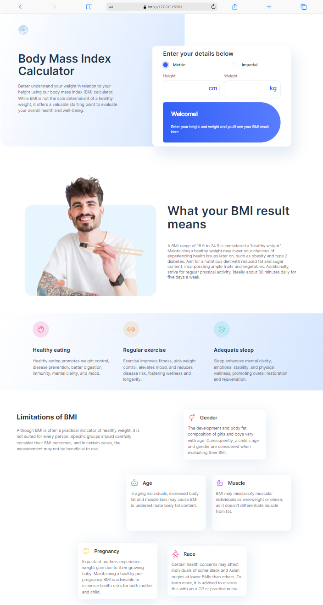
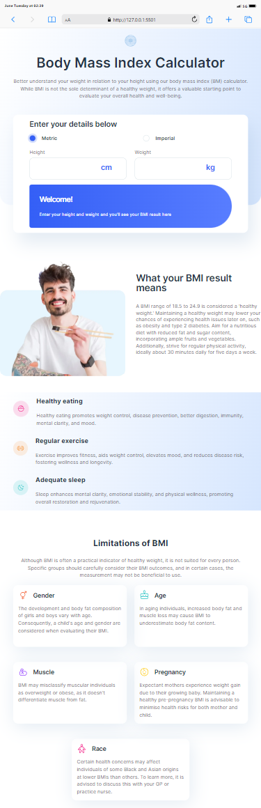
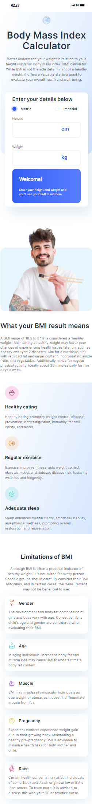

# Frontend Mentor - Body Mass Index Calculator solution

This is a solution to the [Body Mass Index Calculator challenge on Frontend Mentor](https://www.frontendmentor.io/challenges/body-mass-index-calculator-brrBkfSz1T). Frontend Mentor challenges help you improve your coding skills by building realistic projects. 

## Table of contents

- [Overview](#overview)
  - [The challenge](#the-challenge)
  - [Screenshot](#screenshot)
  - [Links](#links)
- [My process](#my-process)
  - [Built with](#built-with)
  - [What I learned](#what-i-learned)
  - [Continued development](#continued-development)
  - [Useful resources](#useful-resources)
- [Author](#author)
- [Acknowledgments](#acknowledgments)

## Overview

### The challenge

Users should be able to:

- Select whether they want to use metric or imperial units
- Enter their height and weight
- See their BMI result, with their weight classification and healthy weight range
- View the optimal layout for the interface depending on their device's screen size
- See hover and focus states for all interactive elements on the page

### Screenshot

### Links

- Live Site URL: [JuniorDev BMI Calc](https://juniordev-bmi-calc-master.vercel.app/)

## My process

### Built with

- Semantic HTML5 markup
- CSS custom properties
- Flexbox
- CSS Grid
- Mobile-first workflow
- Javascript

### What I learned

I learned how to use css grid to style complex grid layouts and also how to refactor codes in javascript

## Author

- Frontend Mentor - [@Manuelcoder02](https://www.frontendmentor.io/profile/Manuelcoder02)
- Twitter - [juniorDev @sotundenuel](https://www.twitter.com/@sotundenuel)
- Instagram - [@sotundenuel](https://www.instagram.com/sotundenuel)

## Acknowledgments

A big thank you to myself for getting this project done and also Special thanks to [George](https://twitter.com/_Annonnymouss_) for always taking time to review my works.
